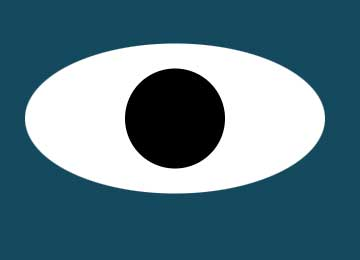

# Eye-Exercise

  
  <a href="https://github.com/LarissaCoop/Eye-Exercise ">&nbsp;&nbsp;&nbsp;&nbsp;&nbsp; Rolling Eye Ball Project</a>

Description:This is a fun interactive set of eyeballs that follow the movement of the mouse on the screen.

Roadmap: I am thinking of adding in different creatures, including a tapeworm whose head will move with the mouse.

This portfolio and individual repository are covered under the MIT license.  Details of which 
can be found at this link.

<a href="https://choosealicense.com/licenses/mit/">MIT License</a>
